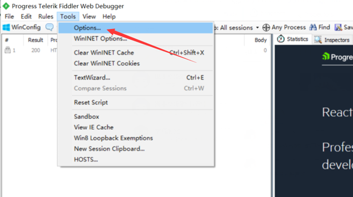
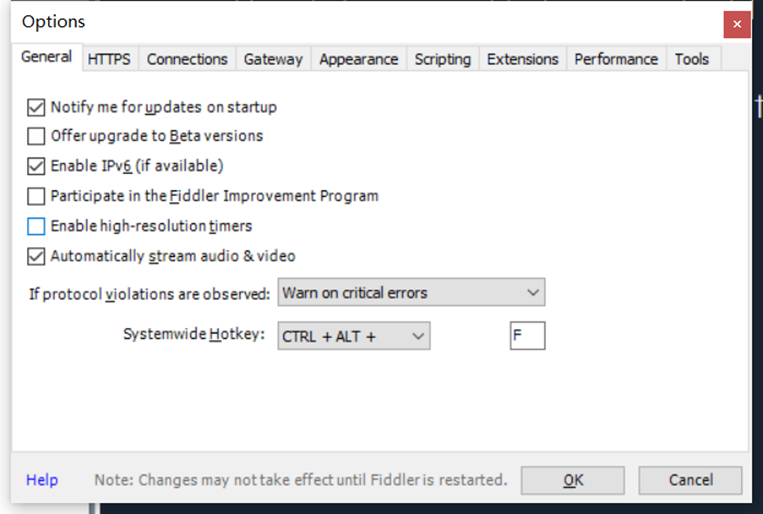
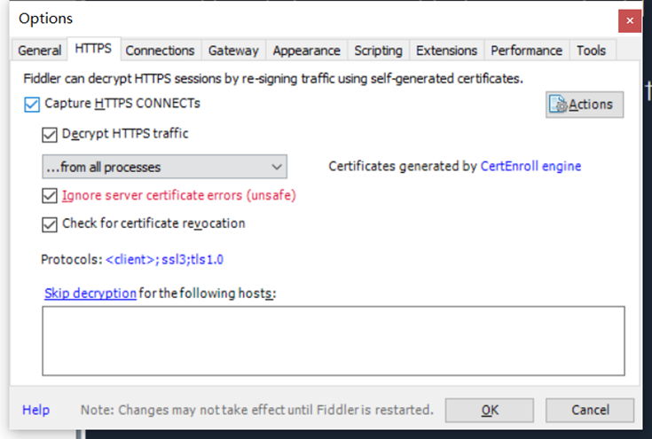
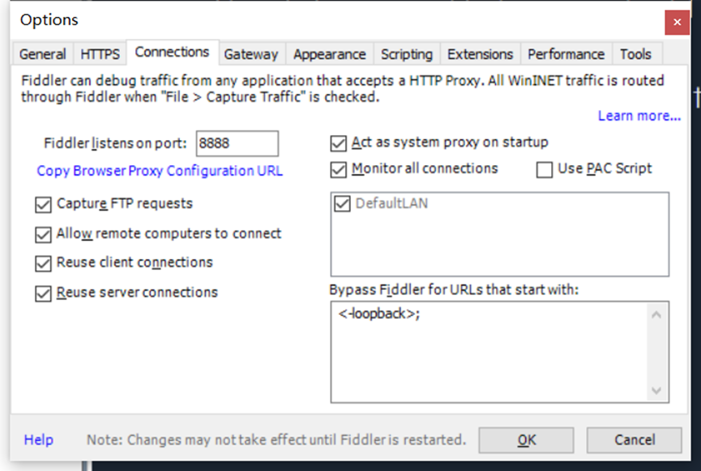

## 补充依赖
docker exec -it QL bash -c "npm install nodemailer"
docker exec -it QL bash -c "npm install node-fetch --save"

# 加密脚本【无法保证ck安全】
## 如需执行加密代码 更改拉库指令如下
```
ql repo https://github.com/JDWXX/jd_job.git "jd_|jx_|gua_|jddj_|getJDCookie" "activity|backUp" "^jd[^_]|USER|function|utils|ZooFaker_Necklace.js|JDJRValidator|sign_graphics_validate|ql|send"
```
## 如需过滤加密代码 更改拉库指令如下
```
ql repo https://github.com/JDWXX/jd_job.git "jd_|jx_|gua_|jddj_|getJDCookie" "activity|backUp|jm" "^jd[^_]|USER|function|utils|ZooFaker_Necklace.js|JDJRValidator|sign_graphics_validate|ql|send"
```

## 库里的脚本也来源别的库收集的，我拉代码的时候也尽量检查了一遍，有些代码加密了，但没法保证代码安全，还望大家自己注意点，脚本本意是为了给大家节省时间，希望卡商们别搞的太大给东哥留点家底


### 获取 ck工具 【JDWXX】

##### 下载地址

```
https://vkceyugu.cdn.bspapp.com/VKCEYUGU-4a31945b-22cb-4446-83cb-b078e22c7b51/e8bc629b-2e95-47f6-9a46-f0de6f9638a7.apk
```

### ----------------------------------------------------------------------------

#### 【JDWXX-京东任务】

##### 命令
```
ql repo https://github.com/JDWXX/jd_job.git "jd_|jx_|gua_|jddj_|getJDCookie" "activity|backUp|jm" "^jd[^_]|USER|function|utils|ZooFaker_Necklace.js|JDJRValidator|sign_graphics_validate|ql|send"
```

##### 定时规则

```
0 0 1,10,15 * * *
```

### ----------------------------------------------------------------------------

##### 【JDWXX-非京东任务汇总】

##### 命令

```
ql repo https://github.com/JDWXX/ql_all.git "" "Backup|index|HT.*|sendNotify|ql" "HT.*|sendNotify|ql"
```
##### 备用命令
```
ql repo https://hub.fastgit.org/JDWXX/ql_all.git "" "Backup|index|HT.*|sendNotify|ql" "HT.*|sendNotify|ql"
```
##### 定时规则

```
0 0 1,10,15 * * *
```

## 特别声明:

* 本仓库发布的Script项目中涉及的任何解锁和解密分析脚本，仅用于测试和学习研究，禁止用于商业用途，不能保证其合法性，准确性，完整性和有效性，请根据情况自行判断.

* 本项目内所有资源文件，禁止任何公众号、自媒体进行任何形式的转载、发布。

* jd_job 对任何脚本问题概不负责，包括但不限于由任何脚本错误导致的任何损失或损害.

* 间接使用脚本的任何用户，包括但不限于建立VPS或在某些行为违反国家/地区法律或相关法规的情况下进行传播, jd_job 对于由此引起的任何隐私泄漏或其他后果概不负责.

* 请勿将Script项目的任何内容用于商业或非法目的，否则后果自负.

* 如果任何单位或个人认为该项目的脚本可能涉嫌侵犯其权利，则应及时通知并提供身份证明，所有权证明，我们将在收到认证文件后删除相关脚本.

* 任何以任何方式查看此项目的人或直接或间接使用该Script项目的任何脚本的使用者都应仔细阅读此声明。jd_job 保留随时更改或补充此免责声明的权利。一旦使用并复制了任何相关脚本或Script项目的规则，则视为您已接受此免责声明.

**您必须在下载后的24小时内从计算机或手机中完全删除以上内容.**  </br>
> ***您使用或者复制了本仓库且本人制作的任何脚本，则视为`已接受`此声明，请仔细阅读***


### 为防止账号再次遭到封禁失联,可以加入QQ交流群
### 1群 681030097

### 2群 681030097


## 腾讯云服务器 45元/1年
#### [【腾讯云】618采购季来袭！爆款云服务器18元起，参与活动享多重好礼](https://cloud.tencent.com/act/cps/redirect?redirect=2260&cps_key=13c854d3ec192824956cc079f600753f&from=console)

# 拉取仓库
##### 名称

```
【JDWXX】
```
##### 命令
```
ql repo https://ghproxy.com/https://github.com/JDWXX/jd_job.git "jd_|jx_|gua_|jddj_|getJDCookie" "activity|backUp" "^jd[^_]|USER|function|utils|ZooFaker_Necklace.js|JDJRValidator_Pure|sign_graphics_validate|ql"

```
##### 备用命令
```
ql repo https://hub.fastgit.org/JDWXX/jd_job.git "jd_|jx_|gua_|jddj_|getJDCookie" "activity|backUp" "^jd[^_]|USER|function|utils|ZooFaker_Necklace.js|JDJRValidator_Pure|sign_graphics_validate|ql"

```
##### 定时规则

```
0 10 0 * * *
```

# 使用文档
## 部分脚本说明
### 京东极速版任务 JDWXX_jd_job_jd_speed_signfaker.js 修改任务
### 由 【task JDWXX_jd_job_jd_speed_signfaker.js】 改成 【task JDWXX_jd_job_jd_speed_signfaker.js conc JD_COOKIE】 可以一次性跑全部号，防止号跑不完

## 助力教程

## 抓取 wskey
### 所需软件 抓包工具 （Fiddler） 模拟器 （MM模拟器） （京东无线宝） 
### 软件都在 wskey目录下（main.exe 为 wskey转换ck工具）

### 视频教程： 利用Fiddler抓取京东云app的wskey
#### [https://www.bilibili.com/video/av841105364/](https://www.bilibili.com/video/av841105364/)

#### Fiddler配置






#### 关于脚本推送通知频率

> 如果你填写了推送通知方式中的某一种通知所需环境变量，那么脚本通知情况如下：

> 目前默认只有jd_fruit.js,jd_pet.js,jd_bean_sign.js,jd_bean_change.js,jd_jxnc.js这些脚本(默认)每次运行后都通知

  ```
其余的脚本平常运行都是不通知，只有在京东cookie失效以及达到部分条件后，才会推送通知    
  ```

